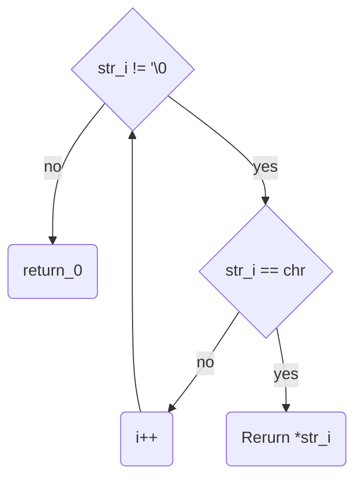

# ft_chrinstr

## Description
checking if charter includet in a string

## Declaration

```char *ft_chrinstr(char *str, int chr)```

## Links

- [back](get_next_line.md)
- [main function](get_next_line.md)
- [README](../../README.md)

### used subfunctions
---



