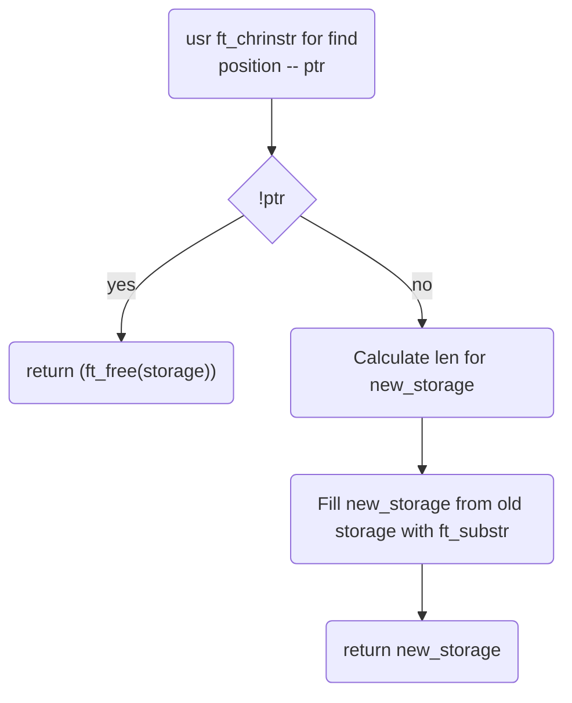

# ft_clean_storage

## Description
Giving a new string after \n cutting the storage and free the old storage! 

## Declaration
```char *ft_clean_storage(char *storage)```
## Links

[back](get_next_line.md)
[main function](get_next_line.md)
[README](../../README.md)

### used subfunctions

