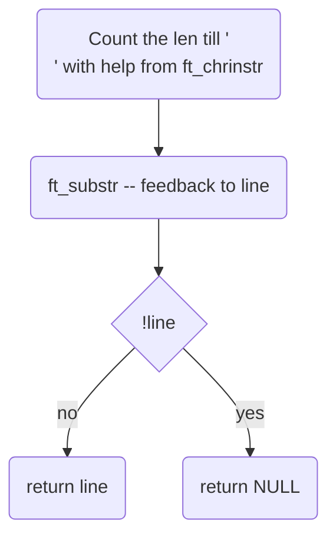

# ft_new_line

## Description
Give a Feedback from from the readed part of the storage without a newline. Filtert newline from storage.   

## Declaration
```char  *ft_new_line(char *storage)``` 

## Links

[back](get_next_line.md)
[main function](get_next_line.md)
[README](../../README.md)

### used subfunctions
- [ft_chrinstr](ft_chrinstr.md)
- [ft_substr](ft_substr.md)

---

