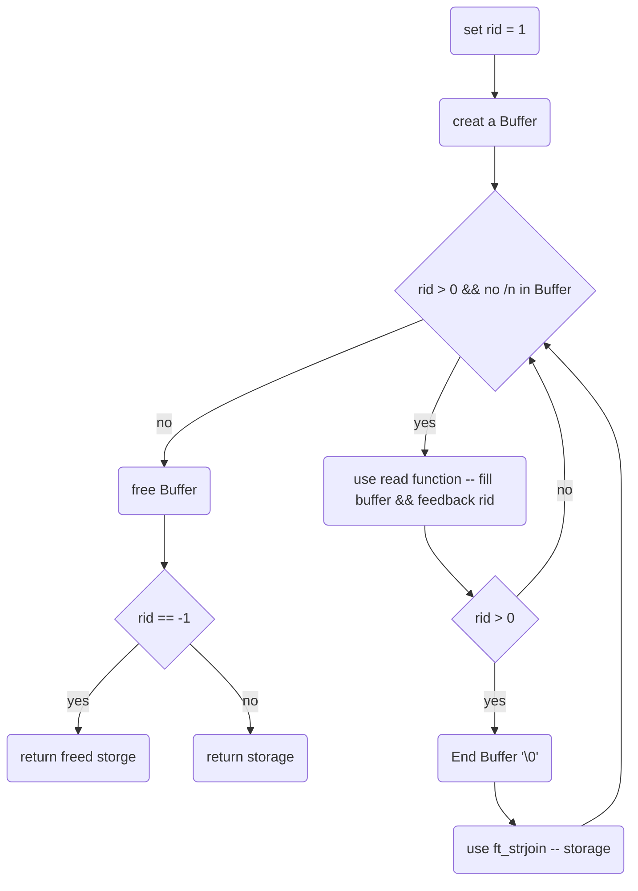

# ft_readbuf

## Description
- read the file in parts of the **BUFFERSIZE** and Checking for /n
- **!! thats Different to mean !!**
## Declaration

```char  *ft_readbuf(int fd, char *storage)```

## Links
- [back](get_next_line.md)
- [main function](get_next_line.md)
- [README](../../README.md)

### used subfunctions
- [ft_chrinstr](ft_chrinstr.md)
- [ft_strjoin](ft_strjoin.md)

---


