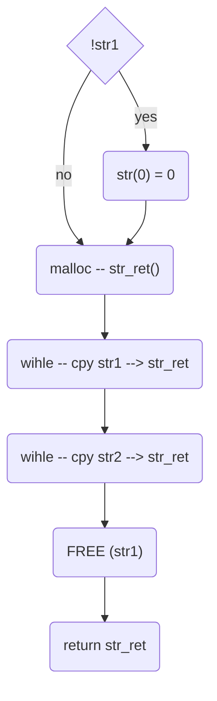

# ft_substr

## Description
conecting to strings together 

## Declaration
```char  *ft_strjoin(char *str1, char *str2)```
## Links

[back](get_next_line.md)
[main function](get_next_line.md)
[README](../../README.md)

### used subfunctions


