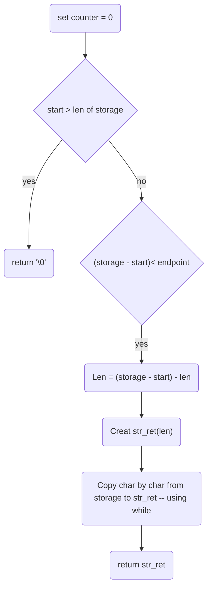

# ft_substr

## Description
Cutting a given String from a start postition to  End possion 

## Declaration
```char *ft_substr(char *s, unsigned int start, size_t len)```
## Links

[back](get_next_line.md)
[main function](get_next_line.md)
[README](../../README.md)

### used subfunctions



