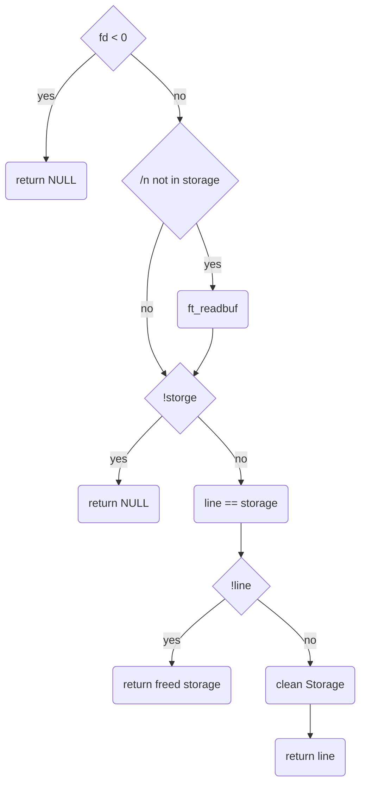

# get next line 
## Description
checking if charter includet in a string, 

## Declaration

```char *ft_chrinstr(char *str, int chr)```

## Links

[back](../../README.md)
[main function](get_next_line.md)
[README](../../README.md)

### used subfunctions
[ft_chrinstr](ft_chrinstr.md)
[ft_readbuf](ft_readbuf.md)
[ft_clean_storage](ft_clean_storage.md)

---

